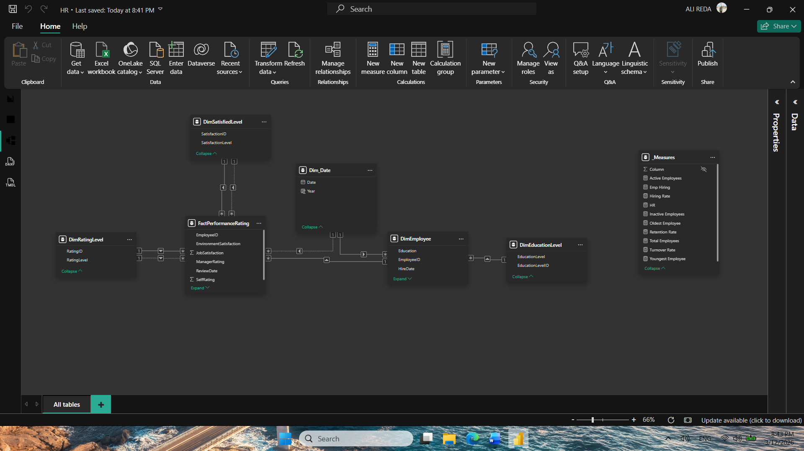
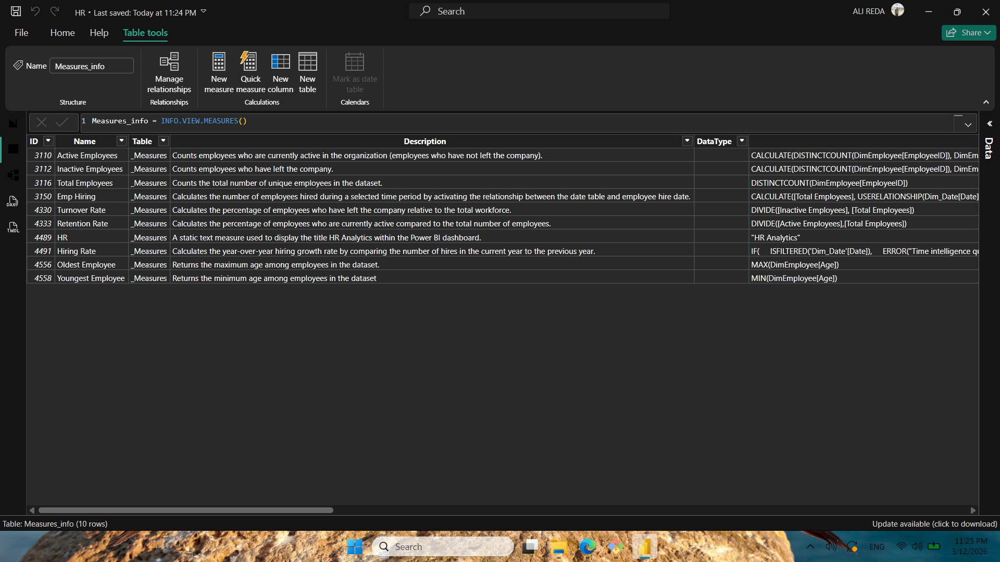
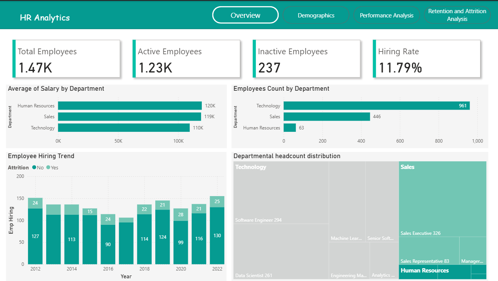
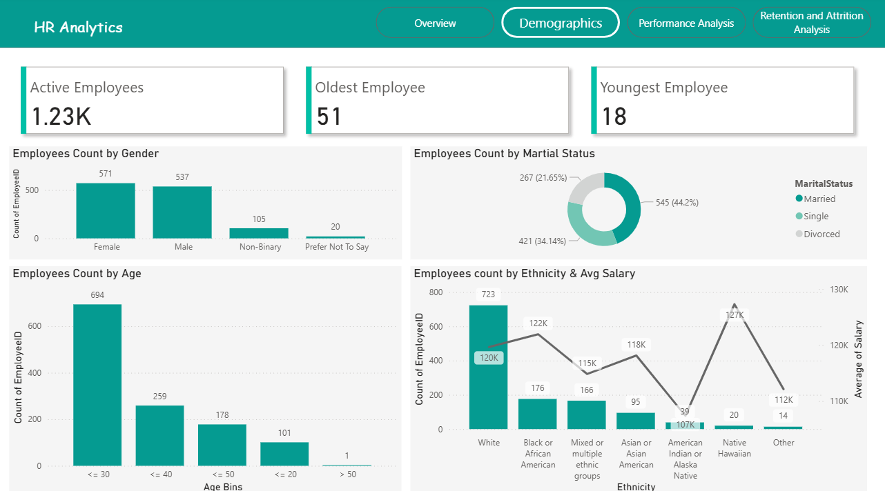
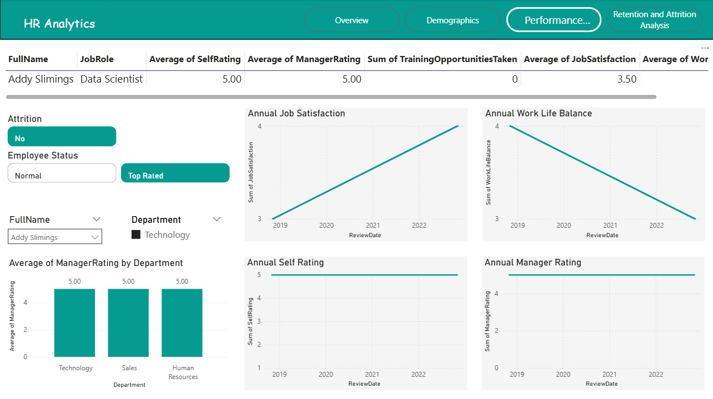
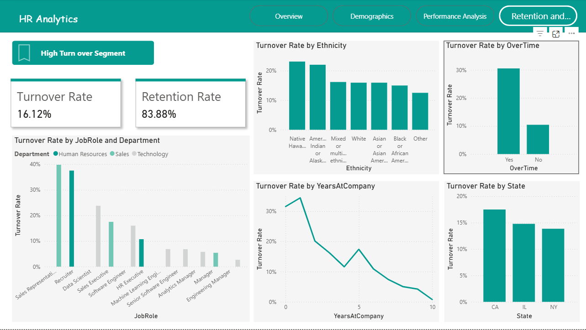
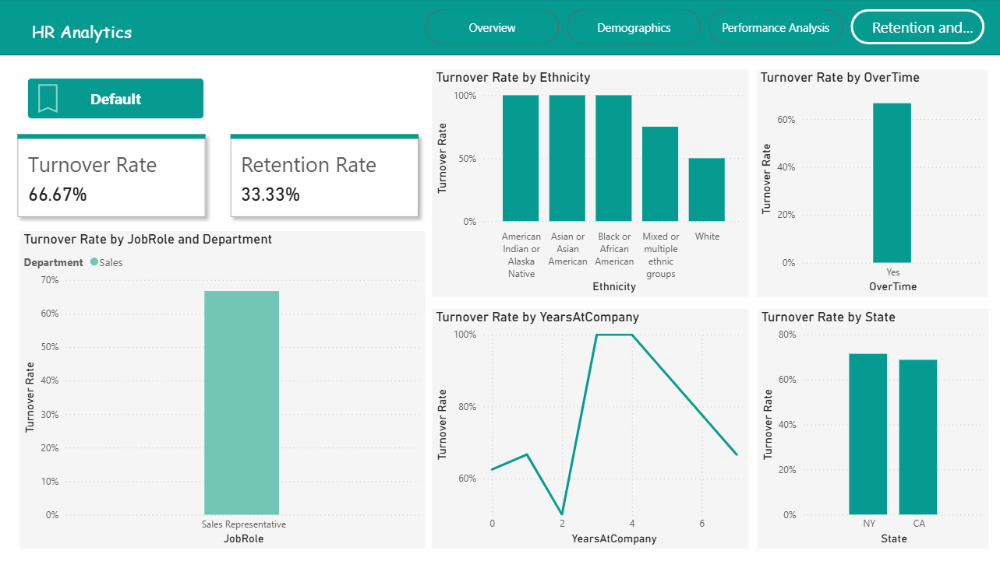

# **HR Analytics Dashboard**

## **1. Project Overview**

The analysis will focus on key HR domains including workforce composition, employee performance, and employee retention. The resulting insights will 
be delivered through analytical reports and dashboards to support HR leadership and 
management.
* Tools used: Power BI, Excel

---

## **2. Business Problem**

* High employee turnover in certain departments
* Lack of visibility into workforce performance
* Need to monitor diversity and demographic trends

---

## **3. Expected Insights**

3.1 Workforce Overview

* Overall workforce composition and structure

* Departmental headcount distribution

* Workforce diversity indicators (gender, age, tenure)

Workforce growth or reduction trends over time

3.2 Workforce Demographics Analysis

* Comprehensive workforce demographic profile

* Gender distribution across departments and roles

* Age group distribution and generational workforce trends

* Education level and qualification distribution

* Identification of demographic imbalances that may require HR attention

3.3 Employee Performance Analysis

* Identification of high-performing departments and employees

* Opportunities for employee development and promotion

* Performance trends across teams, roles, and training programs

3.4 Employee Retention and Attrition Analysis

* Identification of departments with high employee turnover

* Early-stage attrition trends and risk factors

* Potential drivers of employee resignation (tenure, workload, compensation)

## **4. Dashboard Pages & Screenshots**

### **Data Model**

* Description: Snowflake Schema
* Screenshot:
  

### **Measures**

* Description: Measures Description
* Screenshot:
  
  
### **Page 1: Workforce Overview**

* Description: Headcount, department distribution
* Screenshot:
  

### **Page 2: demographics**

* Description: Provides a detailed view of the workforce’s demographic characteristics, including gender distribution, age groups, marital status, and tenure.
* Screenshot:
  

### **Page 3: Employee Performance**

* Description: Performance rating trends, top-performing teams
* Screenshot:
  

### **Page 4: Attrition & Retention**

* Description: Attrition trends, tenure-based insights, high-turnover departments
* Screenshot:
  

### **Page 5: Potential drivers of Attrition**

* Description: Sales Representative with Over time tends more to leave the company
* Screenshot:
  

---

## **5. Key Performance Indicators (KPIs)**

| KPI                        | Description                  |
| -------------------------- | ---------------------------- |
| Total Employee             | Total Number of  employees   |
| Active Employees           | Current  employees           |
| Inactive Employee          | Employees left the company   |
| Hiring Rate                | % of new hires               |
| Attrition Rate             | % of employees leaving       |
| Retention Rate             | % of employees staying       |
| Youngest / Oldest Employee | Age extremes in workforce    |

---

## **6. Challenges Faced**

* Data quality issues (missing hire dates, inconsistent gender fields)
* Integrating multiple HR systems
* Sensitive employee data compliance
* Small sample sizes in some departments

---

## **7. Insights & Recommendations**

* The organization currently has 1.23K total employees across multiple departments.
* The largest departments are Technology and Sales.
* Highest Average Salary is in  HR department.
* The hiring rate is 11.9%, indicating a moderate expansion in workforce capacity.
* Most employees fall in the 20–30 age group, suggesting a relatively young workforce.
* Employees identified as White and Native Hawaiian have the highest average salaries compared to other demographic groups.
* 44.2% of employees are married.
* The workforce age ranges from 18 years (youngest employee) to 55 years (oldest employee).
* Although the differences are not very large, the HR department still shows the strongest overall performance level.
* The Sales department has the highest attrition rate, particularly The Sales Representative role has the highest turnover rate at 39.5%.
* Employees who work overtime are more likely to leave the company.
* The turnover rate decreases as the number of years in the company increases.

---

## **8. Tools & Technologies**

* **Microsoft Power BI**
* Excel
* Data modeling, DAX measures, calculated columns

